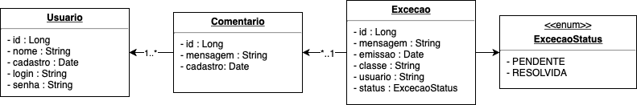

## Avaliação final ##

**Objetivo:** construir um sistema de monitoramento de exceções

### Instruções ###
* Construa dois projetos: **gerador de exceções** e **monitor de exceções**. O primeiro deverá ser preparado com uma estrutura que suporte páginas  **JSP** e o segundo páginas **JSF**.

* Crie um banco de dados único que será acessado pelas duas aplicações, contendo as respectivas tabelas que contemple as entidades do diagrama de classes abaixo:

* Crie as classes Java que representem as tabelas descritas no modelo, as classes de conexão JDBC e os DAO para o cadastro de Usuários, Exceções e Comentários. Essas classes devem estar nos dois artefatos.

#### Artefato 1 - Projeto Gerador de Exceções ####
* Crie um cadastro básico de usuário, incluindo o campos descritos no modelo. Nesse cadastro, será possível gerar as seguintes exceções:
    1. Falha ao conectar ao banco de dados
    2. Usuário já existe
    3. Senha fraca
    4. Falha interna ao criar usuário
3. Essas exceções devem ser capturadas e salvas como novos registros da entidade  "Excecao"
4. Caso nenhuma exceção seja gerada, o usuário deverá ser salvo no banco de dados

#### Arfefato 2 - Projeto Monitor de Exceções ####
* Crie uma página de autenticação inicial que considere os campos login e senha do usuário
* A página principal deverá exibir uma tabela contendo a lista das exceções geradas e seus metadados (mensagem, classe, data de emissão, status)
* Uma das colunas da tabela deverá ser a opção "atualizar", que levará a um formulário no qual o usuário poderá incluir um comentário sobre a exceção e mudar o seu status de pendente para resolvida.
* Ao adicionar um comentário, o campo "usuario" deverá ser preenchido com o usuário logado
* A página principal (listagem de exceções) só deverá ter acesso por usuários autenticados.

Os dois artefatos deverão ser construídos separadamente e submetidos através do seguinte formulário:
https://forms.gle/HW5PdfEZiQfyvSYu6
